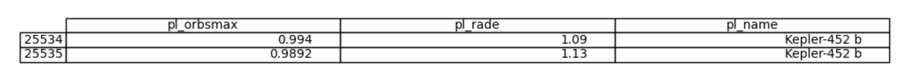

# Potentially Habitable Exoplanets 
Simple python task to identify a potentially habitable exoplanet from the NASA archives. 

## Modules used: 


## The Code: 
```python
# Import Python Modules 
import pandas as pd
import numpy as np
import matplotlib.pyplot as plt
import math
from pandas.plotting import table

#Import Data
Data = pd.read_csv("PS_2024.05.17_06.04.14.csv",skiprows = 36)
```
The data is filtered to get information on the planetary radius and the maximum orbital radius of the exoplanet. These data sets are compared to that of Earth's to determine a potentially habitable exoplanet. 

```python
#Cut data
orbitalradius = Data["pl_orbsmax"]
planetaryradius = Data["pl_rade"]

#Plot the data 
fig = plt.figure(figsize=(12,16))
ax1 = fig.add_subplot(311)
ax1.plot(orbitalradius, planetaryradius, marker = 'x', linestyle = '', color = 'c', label = 'Planets')
ax1.set_ylabel("planetary radius [Earth radii]")
ax1.set_xlabel("orbital semi-major axis[au]")
ax1.set_title("orbital radius vs planetary radius")
ax1.set_yscale('log')
ax1.set_xscale('log')
plt.savefig("Nasa_archive.png")
plt.show()
```

Habital exoplanets will have similar a planetary and orbital radius to that of Earths. The earth has a planetary radius of 1 [earth radii] and an orbital semi major axis of 0.99992 [au]. We are looking for a planet with data near these values. 

```python
#Planetary analysis
Info2 = Data[(Data["pl_orbsmax"] > 0.7) & (Data["pl_orbsmax"] < 1.3) & (Data["pl_rade"] > 0.7) & (Data["pl_rade"] < 1.3)]
Info4 = Info2["pl_name"].unique()
```
From this, it is found that only one planet in NASA's database could be a candidate for habitability: **The Kepler-452 b**
```python
#Planetary analysis
Planet = Data[(Data["pl_orbsmax"] > 0.7) & (Data["pl_orbsmax"] < 1.3) & (Data["pl_rade"] > 0.7) & (Data["pl_rade"] < 1.3)]
Planet_name = Planet["pl_name"].unique()
Planet_info = Planet[Planet["pl_name"].isin(Planet_name)]

ax = plt.subplot(111, frame_on=False)
ax.xaxis.set_visible(False) 
ax.yaxis.set_visible(False)
table(ax,Planet_info[["pl_orbsmax","pl_rade","pl_name"]] , loc="center")
plt.savefig("habitable_planets.png")
plt.show()
```

