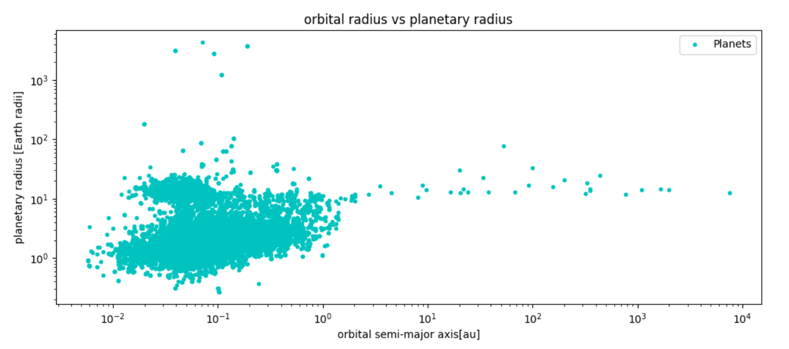
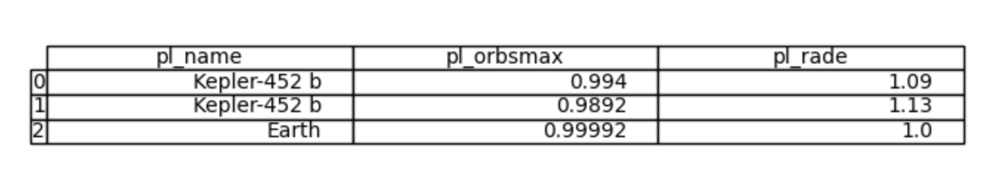
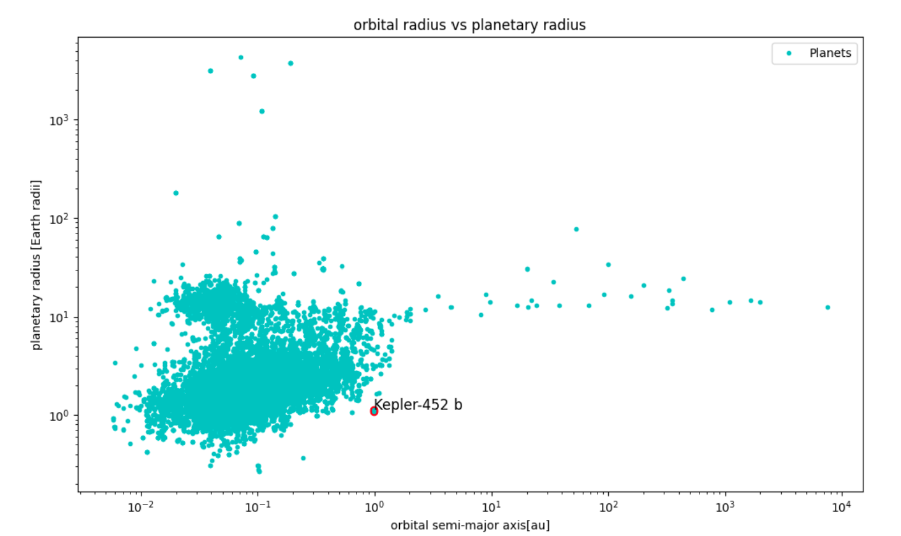

# Potentially Habitable Exoplanets 
Simple Python task to identify a potentially habitable exoplanet from the NASA planetary archives **_[date of access: 17 May 2024 - [View PS_2024.05.17_06.04.14.csv](PS_2024.05.17_06.04.14.csv)]_**. 

## Modules used: 


## The Code: 
```python
# Import Python Modules 
import pandas as pd
import numpy as np
import matplotlib.pyplot as plt
import math
from pandas.plotting import table

#Import Data
Data = pd.read_csv("PS_2024.05.17_06.04.14.csv",skiprows = 36)
```
The data is filtered to get information on the planetary radius and the maximum orbital radius of the exoplanet. These data sets are compared to that of Earth's to determine a potentially habitable exoplanet. 

```python
#Cut data
orbitalradius = Data["pl_orbsmax"]
planetaryradius = Data["pl_rade"]

#Plot the data 
fig = plt.figure(figsize=(12,16))
ax1 = fig.add_subplot(311)
ax1.plot(orbitalradius, planetaryradius, marker = 'x', linestyle = '', color = 'c', label = 'Planets')
ax1.set_ylabel("planetary radius [Earth radii]")
ax1.set_xlabel("orbital semi-major axis[au]")
ax1.set_title("orbital radius vs planetary radius")
ax1.set_yscale('log')
ax1.set_xscale('log')
plt.savefig("Nasa_archive.png")
plt.show()
```

Habital exoplanets will have similar a planetary and orbital radius to that of Earths. The earth has a planetary radius of 1 [earth radii] and an orbital semi major axis of 0.99992 [au]. We are looking for a planet with data near these values. 

```python
#Planetary analysis
Planet = Data[(Data["pl_orbsmax"] > 0.7) & (Data["pl_orbsmax"] < 1.3) & (Data["pl_rade"] > 0.7) & (Data["pl_rade"] < 1.3)]
Planet_name = Planet["pl_name"].unique()
Planet_info = Planet[Planet["pl_name"].isin(Planet_name)]
```
From this, it is found that only one planet in NASA's database could be a candidate for habitability: **The Kepler-452 b**
```python
#Planetary analysis
Planet = Data[(Data["pl_orbsmax"] > 0.7) & (Data["pl_orbsmax"] < 1.3) & (Data["pl_rade"] > 0.7) & (Data["pl_rade"] < 1.3)]
Planet_name = Planet["pl_name"].unique()
Planet_info = Planet[Planet["pl_name"].isin(Planet_name)]

#combined with earth information 
Earth_df = pd.DataFrame({'pl_name': ['Earth'],'pl_orbsmax' : [0.99992], 'pl_rade': [1.0]})
Cut_planet_info = Planet_info[["pl_name","pl_orbsmax","pl_rade"]]
Combined_df = pd.concat([Cut_planet_info, Earth_df], ignore_index = True)

fig2, ax2 = plt.subplots(figsize=(8, 2))
ax2.axis('off')
table(ax2, Combined_df, loc="center")
plt.savefig("table.png")
plt.show()
```

Tthe Kepler-452 b exoplanet can be identified on the previous orbital vs planetary radius graph. 

```python
#identify the planet on the graph 
plt.plot(orbitalradius, planetaryradius, marker = '.', linestyle = '', color = 'c', label = 'Planets')
plt.ylabel("planetary radius [Earth radii]")
plt.xlabel("orbital semi-major axis[au]")
plt.title("orbital radius vs planetary radius")
plt.yscale('log')
plt.xscale('log')
plt.legend()

kepler_orbital = np.array([0.9940, 0.9892])
kepler_planetary = np.array([1.09, 1.13])
plt.scatter(kepler_orbital, kepler_planetary, color = "red")
plt.text(kepler_orbital[1], kepler_planetary[1], "Kepler-452 b", ha = 'left', fontsize = 12)
plt.savefig("kepler.png")
plt.show()
```



## Kepler-452 b 
The Kepler-452 b, an exoplanet nicknamed 'Earth's Cousin', is 1799 light years away from earth. It orbits a star, Kepler 452, just as earth orbits the sun and has 364.8 days in a year. The planet was discovered in 2015 by the Kepler Space Telescope launched by NASA in 2009 with the mission of identifying earth-sized planets orbiting other stars ouside our galaxy. 

*Info@ https://science.nasa.gov/exoplanet-catalog/kepler-452-b/*

To run this project in Jupyter Notebooks: [View Potentially_Habitable_Exoplanets.ipynb](Potentially_Habitable_Exoplanets.ipynb)]
